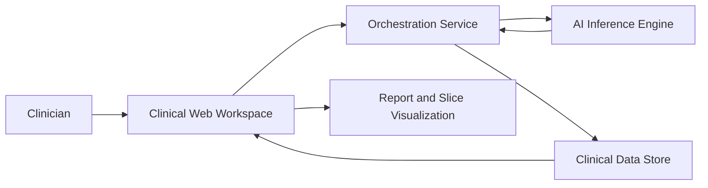

# PneumOrpheus

PneumOrpheus is a clinical decision-support application for pulmonary cancer review.
It helps clinicians upload chest imaging studies, generate AI-assisted analysis reports, and follow patient-level findings over time in one secure workspace.

## What PneumOrpheus Does

- Converts uploaded chest imaging studies into structured, reviewable analysis reports.
- Presents model outputs in a clinically readable format, including confidence and rationale.
- Supports patient-level follow-up with historical report visibility.
- Enables faster triage and prioritization without replacing clinical judgment.

## Who It Is For

- Radiologists and pulmonary specialists who review chest studies.
- Oncology teams tracking disease classification and progression signals.
- Clinical workflows that require explainable AI outputs and auditable report history.

## Core Capabilities

- Secure sign-in with user-scoped access to patients and reports.
- New analysis creation from chest imaging uploads.
- Per-report detail view with:
	- Predicted cancer subtype
	- Confidence score
	- AI reasoning/explanation text
	- Proposed TNM stage
	- Region/side-specific classification entries (when provided)
	- Segmentation-aware visualization with slice exploration
- Dedicated patient overview with latest associated report status.
- Bilingual interface support (English and Norwegian).

## End-to-End Clinical Workflow

1. Clinician signs in and opens New Report.
2. Study metadata is entered (patient identifier, name, modality, clinician email).
3. A supported chest imaging file is uploaded.
4. The analysis service processes the study and returns structured results.
5. PneumOrpheus stores the report and links it to the patient profile.
6. Clinician reviews findings, confidence, rationale, and visual slices to support interpretation.

## System Architecture

PneumOrpheus is designed as a connected diagnostic workflow with clear separation of responsibilities.

### 1) Clinical Interaction Layer

- Web application for sign-in, report creation, report review, and patient overview.
- Language-aware and role-friendly interface for daily clinical operations.

### 2) Workflow Orchestration Layer

- Receives uploaded case metadata and study files.
- Performs input validation and routes studies to the inference service.
- Normalizes AI output into a consistent report model for clinician review.

### 3) AI Inference Layer

- Processes imaging studies and generates diagnostic outputs.
- Returns classification, confidence, rationale, and optional segmentation payload.

### 4) Clinical Data Layer

- Persists patient records, report metadata, and AI results.
- Maintains user-scoped access control so each clinician only accesses authorized data.
- Supports longitudinal viewing of prior analyses for follow-up use.

### 5) Visualization Layer

- Renders processed image slices and mask overlays (if available).
- Exposes slice-level navigation to improve explainability during review.

## High-Level Data Flow

## Data Handling and Privacy

- Uploaded scan bytes are used for inference processing and are not stored as raw imaging artifacts in the application data store.
- PneumOrpheus stores report metadata and model outputs needed for clinical review and continuity.
- Access to patient/report data is scoped per authenticated user context.
- File type and size safeguards are enforced before processing.

## Clinical Output Model

Each analysis report can include:

- Report identifier and timestamp
- Patient metadata
- Study modality and file metadata
- Summary findings
- Predicted cancer type
- Classification confidence
- Reasoning text
- Proposed TNM stage
- Optional side/region-level classifications
- Optional segmentation and visualization-ready slice data

## Safety and Responsible Use

- PneumOrpheus is an assistive system for clinical decision support.
- Final diagnosis and treatment planning remain the responsibility of licensed clinicians.
- Confidence scores and AI rationale should be interpreted alongside imaging evidence, patient history, and institutional protocols.

## Typical Use Cases

- Rapid first-pass review of incoming chest studies.
- Structured second-look support before multidisciplinary discussion.
- Follow-up comparison of patient reports over time.
- Better handoff quality between imaging review and oncology and/or treatment planning.

## Product Scope Summary

PneumOrpheus combines secure case intake, explainable AI analysis, and longitudinal patient report tracking into one clinical workflow. The goal is to shorten review time, improve consistency of interpretation support, and strengthen continuity of care across pulmonary cancer assessment pathways.
